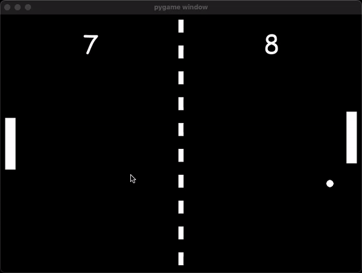

## Pong AI

A modern take on the classic Pong game, now featuring an AI opponent trained using NEAT (NeuroEvolution of Augmenting Topologies).



---

### Getting Started

1. **Installation**
   - Ensure you have Python 3.11 or newer installed.
   - Install the required Python packages:
     ```
     pip install -r requirements.txt
     ```

2. **Playing the Game**
   - Use the W and S keys to move your paddle up and down respectively.
   - Your goal is to bounce the ball with your paddle and try to get it past the AI opponent.

3. **Training the AI**
   - The game uses NEAT to train an AI opponent. The configuration for NEAT is stored in `config.txt`.
   - The AI training can be initiated using the `train_ai` method in `tutorial.py`.

4. **Testing the AI**
   - Once trained, you can test the AI's performance using the `test_ai` method in `tutorial.py`.

---

### Code Overview

- **ball.py**: Contains the `Ball` class, which defines the behavior of the ball in the game.
- **game.py**: Contains the `Game` class, which has all the primary game logic, including scoring and paddle movement.
- **paddle.py**: Contains the `Paddle` class, which defines the behavior of the paddles.
- **config.txt**: This is the configuration file for NEAT.
- **tutorial.py**: Contains functions to train and test the AI using NEAT.

Sure! Here's an explanation of NEAT (NeuroEvolution of Augmenting Topologies) and some details about how it works, suitable for inclusion in a `readme.md` file:

---

### NEAT (NeuroEvolution of Augmenting Topologies)

#### What is NEAT?

NEAT stands for "NeuroEvolution of Augmenting Topologies". It is an algorithm used for evolving artificial neural networks. NEAT simultaneously optimizes both the weights and the structures of neural networks. Instead of starting with a large, dense neural network and pruning it over time, NEAT starts with small, simple networks and allows them to become complex over generations, allowing for both structural and weight optimization.

#### Mathematical Foundations

1. **Genomes Encoding**: Every network is encoded into genomes. These genomes include node genes (representing neurons) and connection genes (representing synapses).

2. **Speciation**: To protect innovative topologies that might not initially be the fittest in their ecosystem, NEAT divides populations into species. Each species is allowed to develop independently, reducing the chance that initial weaker structures get eliminated before they can optimize.

3. **Crossover**: When reproducing networks from the same species, a crossover operation is performed, mixing genes (both node and connection genes) from both parent genomes.

4. **Mutation**: Genomes are subject to mutations. These mutations can:
    - Adjust weights on connections.
    - Add new nodes (by splitting existing connections).
    - Add new connections between existing nodes.

5. **Compatibility Distance**: To determine which species a particular genome belongs to, the genome's compatibility distance to existing species' representatives is calculated using:

\[ d = \frac{c_1E}{N} + \frac{c_2D}{N} + c_3 \cdot W \]

Where:
    - \( E \) is the number of excess genes.
    - \( D \) is the number of disjoint genes.
    - \( W \) is the average weight differences of matching genes.
    - \( N \) is the number of genes in the larger genome (to normalize for genome size).
    - \( c_1, c_2, \) and \( c_3 \) are configurable coefficients.

#### Key Features of NEAT

1. **Starts Simple**: NEAT starts evolution with small, simple networks which allows it to search the solution space efficiently.

2. **Complexifying Over Time**: Over generations, the networks can become more complex by adding nodes and connections through mutations.

3. **Protecting Innovation**: Through speciation, newer and potentially weaker innovations are protected allowing them to mature and optimize over generations.

4. **No Pre-defined Topology**: Unlike many other methods, NEAT doesn't require a predefined number of layers or nodes. It discovers the best topology on its own.

#### Conclusion

NEAT is a powerful and versatile algorithm in the field of neural network evolution. It combines both topology and weight evolution in a manner that has been shown to be effective across a wide range of tasks. The algorithm's ability to start small and grow in complexity as needed allows it to remain efficient and effective.

---

### Credits

Ansh Sharma